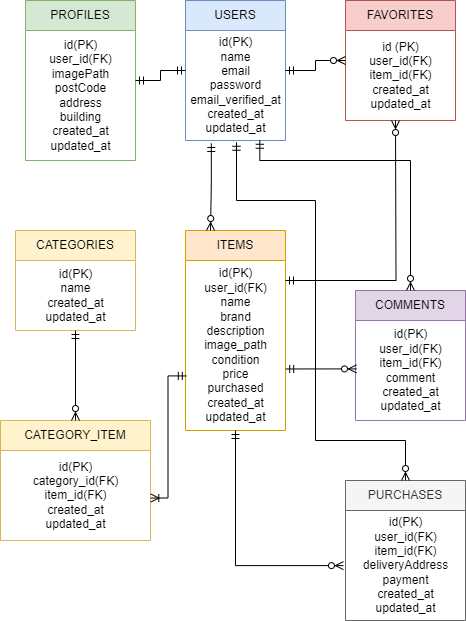

# flea-market

## 環境構築

### Docker ビルド

1. git clone https://github.com/wataru-xxxg/flea-market.git
1. docker-compose up -d --build

### Laravel 環境構築

1. docker-compose exec php bash
1. composer install
1. .env.example ファイルから.env を作成し、環境変数を変更
1. php artisan key:generate
1. php artisan migrate
1. php artisan db:seed
1. php artisan storage:link

## 使用技術(実行環境)

- PHP 7.4.9
- Laravel 8.83.29
- MYSQL 8.0.26

## ER 図

## URL

- 開発環境：http://localhost/
- phpMyAdmin：http://localhost:8080/
- mailhog：http://localhost:8025/

## ログイン情報

### テスト 1

- email：test1@test.com
- password：password
- CO01 ～ CO05 の出品者

### テスト 2

- email：test2@test2.com
- password：password
- CO06 ～ CO10 の出品者

### テスト 3

- email：test3@test.com
- password：password
