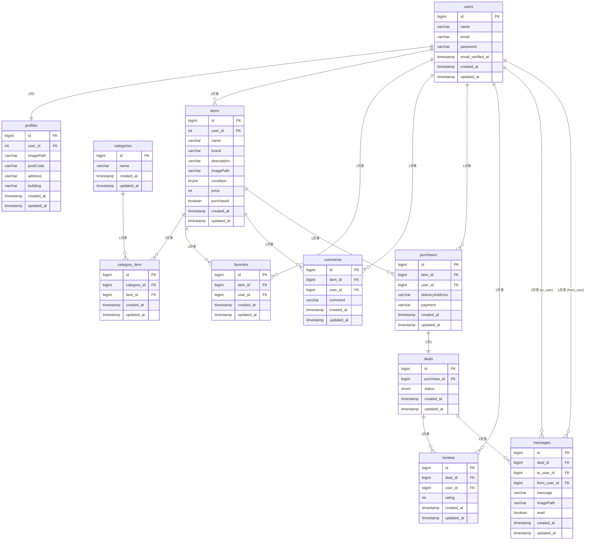

# フリーマーケットアプリケーション ER 図

## データベース構造図

## テーブル説明

### 主要テーブル

1. **users** - ユーザー情報

   - 基本的なユーザー認証情報を管理

2. **profiles** - ユーザープロフィール

   - 住所やプロフィール画像などの詳細情報

3. **items** - 商品情報

   - 出品される商品の詳細情報

4. **categories** - カテゴリ
   - 商品のカテゴリ分類

### 中間テーブル

5. **category_item** - カテゴリと商品の多対多関係
6. **favorites** - お気に入り機能
7. **comments** - 商品へのコメント

### 取引関連テーブル

8. **purchases** - 購入情報
9. **deals** - 取引状態管理
10. **reviews** - レビュー・評価
11. **messages** - 取引者間のメッセージ

## 主要なビジネスフロー

1. **商品出品**: users → items
2. **商品購入**: users → purchases → deals
3. **取引完了**: deals → reviews
4. **コミュニケーション**: deals → messages
