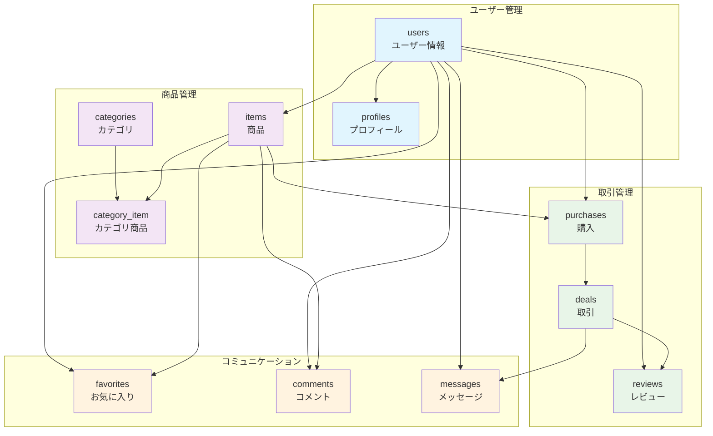

# フリーマーケットアプリケーション ER 図（簡易版）

## データベース構造

## テーブル一覧

| テーブル名      | 説明                 | 主要なカラム                      |
| --------------- | -------------------- | --------------------------------- |
| `users`         | ユーザー基本情報     | id, name, email, password         |
| `profiles`      | ユーザープロフィール | user_id, address, imagePath       |
| `categories`    | 商品カテゴリ         | id, name                          |
| `items`         | 商品情報             | user_id, name, price, condition   |
| `category_item` | カテゴリ商品関連     | category_id, item_id              |
| `favorites`     | お気に入り           | user_id, item_id                  |
| `comments`      | 商品コメント         | user_id, item_id, comment         |
| `purchases`     | 購入情報             | user_id, item_id, deliveryAddress |
| `deals`         | 取引状態             | purchase_id, status               |
| `reviews`       | レビュー             | deal_id, user_id, rating          |
| `messages`      | メッセージ           | deal_id, from_user_id, to_user_id |

## 主要なリレーションシップ

- **1 対 1**: users ↔ profiles
- **1 対多**: users → items, purchases, reviews
- **多対多**: categories ↔ items (via category_item)
- **1 対 1**: purchases ↔ deals
- **1 対多**: deals → reviews, messages
